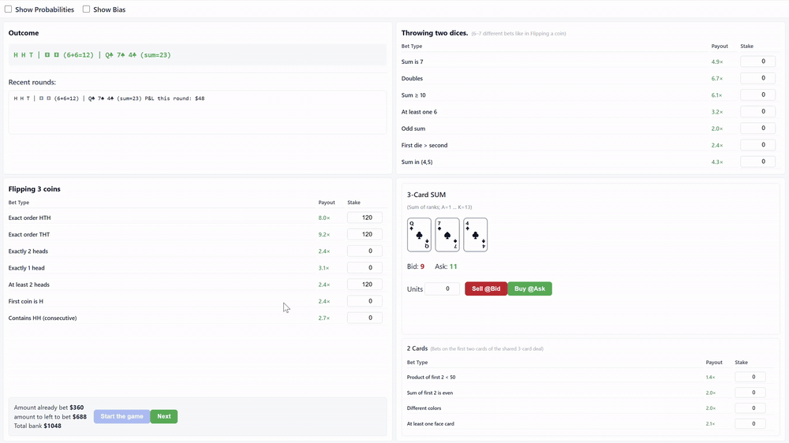

# 🎲 Betting Suite

An interactive probability education tool built with React and TypeScript. Play four simultaneous betting games — coin flips, dice rolls, a card market, and a two-card side bet — all in a single round. Each game surfaces the true mathematical probability alongside a randomized payout multiplier, so you can develop intuition for expected value in real time.




---

## Table of Contents

- [Overview](#overview)
- [Games](#games)
  - [Coin Flips](#-coin-flips)
  - [Dice](#-dice)
  - [3-Card Market](#-3-card-market)
  - [2-Card Side Bets](#-2-card-side-bets)
- [Bias System](#bias-system)
- [Round Flow](#round-flow)
- [Tech Stack](#tech-stack)
- [Project Structure](#project-structure)
- [Getting Started](#getting-started)
- [Build & Deploy](#build--deploy)
- [Known Limitations](#known-limitations)

---

## Overview

Betting Suite simulates a realistic betting environment where outcomes are random but probabilities are mathematically exact. Every bet displays:

- **Probability** — the true chance of winning, calculated analytically
- **Payout multiplier** — how much profit a winning stake returns (e.g. `2.4×` means a $10 bet wins $24 profit)
- **Bias label** — whether the current multiplier favors the House, the Player, or is Fair

Players start with a **$1,000 bank** and place stakes across all four games before each round resolves simultaneously.

---

## Games

### 🪙 Coin Flips

Three fair coins are flipped. Seven bet types are offered:

| Bet | Probability |
|-----|-------------|
| Exact order HTH | 1/8 = 12.5% |
| Exact order THT | 1/8 = 12.5% |
| Exactly 2 heads | 3/8 = 37.5% |
| Exactly 1 head | 3/8 = 37.5% |
| At least 2 heads | 4/8 = 50.0% |
| First coin is H | 1/2 = 50.0% |
| Contains HH (consecutive) | 3/8 = 37.5% |

### 🎲 Dice

Two standard six-sided dice are rolled. Seven bet types are offered:

| Bet | Probability |
|-----|-------------|
| Sum is 7 | 6/36 ≈ 16.7% |
| Doubles | 6/36 ≈ 16.7% |
| Sum ≥ 10 | 6/36 ≈ 16.7% |
| At least one 6 | 11/36 ≈ 30.6% |
| Odd sum | 18/36 = 50.0% |
| First die > second | 15/36 ≈ 41.7% |
| Sum in {4, 5} | 7/36 ≈ 19.4% |

### 🃏 3-Card Market

Three cards are drawn without replacement from a standard 52-card deck (A=1, J=11, Q=12, K=13). A **bid/ask spread** is quoted on the sum of all three ranks. You take a position before the cards are revealed:

- **Buy @Ask** — you profit if the actual sum is above the ask price
- **Sell @Bid** — you profit if the actual sum is below the bid price

P&L = Units × (Actual Sum − Entry Price) for a buy; Units × (Entry Price − Actual Sum) for a sell.

The spread (2–4 points) is randomly generated, with a 25% chance of a slight player edge baked in. Cards are revealed at round end.

### 🂠 2-Card Side Bets

The first two cards of the same three-card deal are used for a separate set of bets:

| Bet | Probability |
|-----|-------------|
| Product of first 2 < 50 | ≈ 78.4% |
| Sum of first 2 is even | ≈ 51.0% |
| Different colors | ≈ 51.0% |
| At least one face card (J/Q/K) | ≈ 47.1% |

---

## Bias System

Each round, every bet's multiplier is generated using a weighted random process:

| Bias | Probability | Multiplier range |
|------|-------------|-----------------|
| **Fair** | 45% | 98–102% of fair value |
| **House** | 35% | 80–95% of fair value |
| **Player** | 20% | 105–125% of fair value |

The fair-value multiplier for a bet with probability *p* is `1/p` (rounded to one decimal, minimum 1.1×). Bias labels and probabilities can be toggled on/off via the toolbar checkboxes.

Because the house bias is more likely than the player bias, the suite is designed to be a small negative EV environment overall — matching how real betting markets operate.

---

## Round Flow

```
┌──────────────────────────────────────────────────────┐
│  1. Multipliers refreshed → place stakes + market    │
│  2. Click "Start the game"                           │
│     • Total stake deducted from bank                 │
│     • Coins, dice, and 3 cards generated             │
│     • All bets settled simultaneously                │
│     • Cards revealed, P&L displayed                  │
│  3. Click "Next" → multipliers refresh, repeat       │
└──────────────────────────────────────────────────────┘
```

Up to 80 rounds of history are stored in memory and displayed in the Outcome panel.

---

## Tech Stack

| Layer | Technology |
|-------|-----------|
| UI framework | React 18 |
| Language | TypeScript 5 |
| State management | Zustand 4 |
| Build tool | Vite 4 |
| Linting | ESLint + TypeScript ESLint |
| Deployment | Vercel |

No UI component library is used — all styling is hand-written CSS.

---

## Project Structure

```
betting-suite/
├── src/
│   ├── App.tsx                  # Round orchestration & bet settlement
│   ├── main.tsx                 # React entry point
│   ├── styles.css               # Global styles
│   │
│   ├── components/
│   │   ├── Outcome.tsx          # Round result + history panel
│   │   ├── Coins.tsx            # Coin flip betting table + controls
│   │   ├── Dice.tsx             # Dice betting table
│   │   ├── Market.tsx           # 3-card bid/ask market
│   │   └── FirstTwo.tsx         # 2-card side bet table
│   │
│   ├── store/
│   │   └── useGameStore.ts      # Zustand store (bank, stakes, terms, history)
│   │
│   └── lib/
│       ├── probabilities.ts     # Analytical probability functions + predicates
│       ├── bias.ts              # Multiplier generation with bias weighting
│       ├── deck.ts              # Card types, deck creation, Fisher-Yates shuffle
│       ├── random.ts            # RNG utilities (int, float, weighted choice)
│       └── format.ts            # Money, multiplier, probability formatters
│
├── public/                      # Static assets (icons, manifest, service worker)
├── dist/                        # Production build output
├── docs/                        # README assets (demo.gif, screenshots)
├── vite.config.ts
├── tsconfig.json
└── vercel.json
```

---

## Getting Started

**Prerequisites:** Node.js ≥ 18

```bash
# Clone the repository
git clone <repo-url>
cd betting-suite

# Install dependencies
npm install

# Start the development server
npm run dev
```

The app opens at `http://localhost:5173` by default.

**Windows users:** double-click `start-betting-suite.bat` or run `start-betting-suite.ps1` from PowerShell for a one-click launch.

---

## Build & Deploy

```bash
# Type-check + production build
npm run build-with-tsc

# Preview the production build locally
npm run preview

# Lint the codebase
npm run lint
```

The project is configured for zero-config deployment on **Vercel** via `vercel.json`.

---

## Known Limitations

- **No persistent storage** — bank and history reset on page refresh. All state is in-memory via Zustand.
- **No reset button** — if you want to restart from $1,000, refresh the page. (A `resetGame` action exists in the store but has no UI trigger yet.)
- **Market fair value approximation** — the bid/ask quote is centred on a sample from three independent uniform [1–13] draws, which is a close but not exact approximation of the actual card-sum distribution (cards are drawn without replacement from a 52-card deck).
- **No test suite** — the probability functions are analytically correct but have no automated tests.
